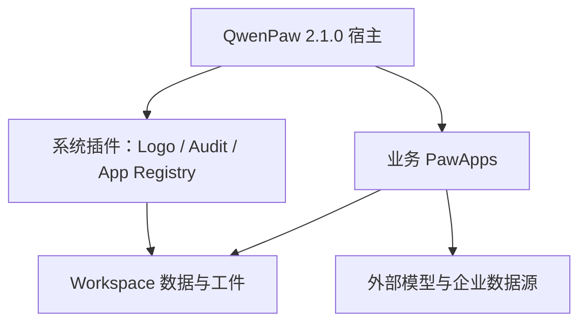
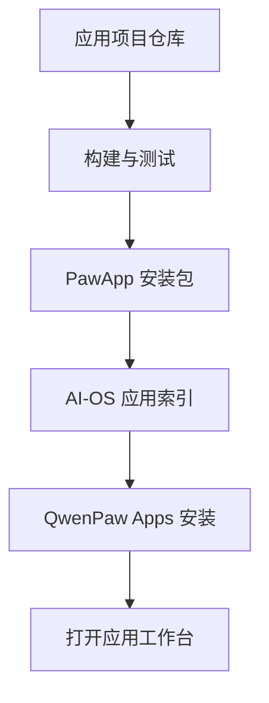

# 智造云 AI-OS 产品需求文档 PRD V6.4（产品确认版）

> 文档状态：产品方向已确认；进入开发前基线。确认日期：2026-08-22。
>
> 目标基线：QwenPaw 2.1.0 + 原生 PawApp 应用体系。
>
> 核心变化：正式放弃独立 8390 企业平台目标架构；所有业务能力参照 QwenPaw Creator 的产品形态和 DataPaw 的数据接地思路，做成独立仓库、可安装、可打开、可独立工作的原生 PawApp，并通过 QwenPaw Apps 加载。Creator 与 DataPaw 均不直接加载。
>
> 部署要求：同一套 AI-OS 与 PawApp 必须支持 Windows、Linux 快速部署；不得形成只在开发者电脑可运行的交付方式。
>
> 数据要求：所有 PawApp 使用统一 Workspace 数据核心；支持 AI 生成带来源标记的模拟数据、Excel 导入真实数据，以及用户通过可视化方式扩展业务字段。
>
> 应用发现：在 `应用 → 我的` 提供关键词和自然语言检索；用户描述要完成的事情时，可以快速找到、打开或安装对应 PawApp。

---

# 1. 文档目的

本 PRD 用于替代以 DeepSeek Harness、独立企业管理平台和固定 8390 服务为中心的旧架构描述，确定智造云 AI-OS 下一阶段的产品边界、应用标准、加载方式、数据组织、Agent 协作、日志审计和验收方法。

本文只定义目标产品，不承诺保留旧技术实现。旧系统中有业务价值的数据、规则和流程可以迁移；旧页面、旧端口、旧模拟器和旧运行链路不作为兼容目标。

# 2. 参考项目与基线

## 2.1 强制参考

| 参考对象 | 项目网址 | 本项目借鉴内容 |
| --- | --- | --- |
| AgentScope Platform 上的 QwenPaw Creator | https://platform.agentscope.io/plugins/qwenpaw-creator | 应用发布、安装和分发形态 |
| QwenPaw Creator 1.1.0 | https://github.com/agentscope-ai/QwenPaw/tree/release/v2.1.0/plugins/apps/qwenpaw-creator | 仅作为开发参考：原生 PawApp、项目工作台、应用内 Agent、资产/工件、审阅、运行依赖、健康检查；不作为 AI-OS 预装应用 |
| QwenPaw | https://github.com/agentscope-ai/QwenPaw/tree/release/v2.1.0 | Apps、PawApp SDK、Workspace、模型、插件生命周期和宿主能力 |
| QwenPaw-Data / DataPaw | https://github.com/agentscope-ai/QwenPaw-Data | 仅参考企业数据接地、托管依赖、语义层和可追溯分析；不直接加载，智造云自研 Data Studio |
| 智造云 AI-OS | https://github.com/Gary0097/zhiyun-ai-platform | 产品主仓库、系统插件、应用清单、打包索引和集成验证 |

## 2.2 “参照 Creator”具体指什么

所有业务应用必须参照 Creator 的产品和工程形态，而不是复制其视频功能：

1. 在 QwenPaw Apps 中以独立应用卡片出现，可安装、打开、更新和卸载。
2. 每个应用拥有自己的首页、项目/任务工作台、后端 API、运行状态和数据目录。
3. 用户可以从一个目标或一批文件开始，Agent 在应用内部持续推进任务。
4. 页面中的业务对象可以成为 Agent 上下文，而不是只能在全局聊天框中描述。
5. Agent 的关键修改可审阅、可接受、可撤销；高成本或高风险执行先确认。
6. 每次执行产生项目、任务、步骤、工件、日志和 Trace，不只返回一段聊天文字。
7. 依赖缺失必须显示结构化状态和修复建议，不能让用户自行猜测某个固定端口是否启动。

# 3. 当前项目判断

## 3.1 已确认可保留

- QwenPaw 2.1.0 作为唯一宿主和主要启动入口。
- 根目录一键启动思路。
- 独立 Logo 配置插件。
- Workspace 内运行日志、审计日志和 SQLite 索引。
- 旧业务数据、知识资料和规则作为迁移输入。
- Node 版遗留配置清理脚本，适配 Desktop exe 环境。

## 3.2 不进入目标架构

- 独立 `apps/enterprise` 作为用户必须启动的第二个平台。
- 固定依赖 `http://127.0.0.1:8390`。
- 浏览器直接感知内部服务端口和 Token。
- Agent 调用 `enterprise_platform_status` 后提示用户手动启动 8390。
- 28 个功能只做菜单入口、假数据展示或聊天演示。
- 用自动模拟数据代替真实任务闭环作为主要验收依据。
- 一套通用聊天 Agent 承担全部业务功能。
- 在脚本中硬编码账号、密码、Token 或客户身份。

## 3.3 对最新 master 两个提交的处理

| 提交 | 处理结论 |
| --- | --- |
| `dba6cdceb9`：Node 等价 cleanup | 保留方向。启动和迁移脚本不能假设 Desktop exe 可被 Python `import qwenpaw`。 |
| `8ce3777e8a`：8390 知识收割轮转与文档提取 | 业务需求保留，技术实现不作为目标。优先迁入 QwenPaw `Workspace → Files → Knowledge Base`；只有原生能力无法覆盖研究包轮转、审阅和发布闭环时才独立开发 Knowledge Studio。固定 8390、脚本登录和硬编码凭据必须移除。 |

# 4. 产品定位

智造云 AI-OS 是运行在 QwenPaw 上的企业 AI 应用工作台：QwenPaw 提供宿主、模型、Workspace、Apps、插件生命周期和基础对话；智造云提供一组面向真实岗位任务的 PawApp。

AI-OS 不再等于“大而全的后台”。用户看到的是一个统一桌面和多个可工作的应用。每个应用解决一个完整岗位场景，并能把结果沉淀为可继续编辑、查询和审计的项目与工件。

## 4.1 一句话体验

用户从 Apps 打开某个业务应用，输入目标或上传资料，应用内 Agent 形成计划、调用工具、更新项目对象、生成可交付成果；用户在关键节点确认，所有过程和结果保存在当前 Workspace。

## 4.2 产品边界

### 系统层负责

- QwenPaw 启动、模型与 Agent 基础能力。
- Apps 安装、启停、升级和卸载。
- Workspace、文件、会话和宿主 API。
- 全局 Logo、日志审计、应用注册和健康检查。

### PawApp 负责

- 某一业务场景的完整 UI 和业务对象。
- 应用内 Agent、工具、工作流和状态机。
- 应用数据、项目、任务、工件和导出。
- 应用自己的依赖检测、恢复和错误提示。

### 暂不建设

- 独立企业管理门户。
- 复杂多租户 SaaS 计费体系。
- Capability 权限中心和通用 Approval 审批平台。
- 为展示而建设的大规模模拟数据中心。
- 所有旧功能一次性迁移。

# 5. 总体架构



运行原则：

- 用户只启动 `qwenpaw app`，默认访问 `http://127.0.0.1:8088`。
- PawApp 后端通过 QwenPaw 生命周期加载；前端通过 Apps 打开。
- 如应用确实需要辅助进程，必须由 PawApp 以 managed service 管理并使用动态回环端口；端口不得暴露给用户。
- 外部数据库、ERP、邮件和第三方 API 是数据源，不得伪装成 QwenPaw 本地核心服务。
- 所有应用默认使用当前 QwenPaw Workspace；应用之间通过工件和明确契约共享数据，不直接读取彼此私有表。

# 6. 统一 PawApp 产品模型

## 6.1 应用入口

每个应用在 Apps 中至少展示：

- 应用名称、图标、版本、分类、简介。
- 安装状态和更新状态。
- 依赖状态：可用、降级、阻塞。
- 打开、更新、卸载操作。

安装完成后，应用从 Apps 打开到 `/apps/<app-id>`。业务应用不加入系统设置侧边栏，不覆盖宿主 Logo，不修改全局欢迎语。

### “我的应用”快速检索

`应用 → 我的` 顶部提供常驻搜索框，同时支持传统关键词和自然语言需求检索：

- 按应用名称、简称、中英文别名、功能名称、功能描述和使用场景搜索。
- 支持中文、英文、拼音首字母、常见同义词、模糊匹配和轻微错别字。
- 支持直接提问，例如“哪个应用能分析订单交付风险”“我要导入Excel做销售分析”“谁能识别发票并审核报销”。
- 结果优先显示已安装应用；未安装但匹配的应用显示“可安装”。
- 每条结果显示应用名称、图标、安装状态、匹配功能、匹配原因和建议操作。
- 支持一键打开、安装、更新，以及将当前问题带入应用新项目。
- 支持分类、安装状态、平台兼容性和健康状态筛选。
- 无匹配结果时展示相关应用和缺失能力，不得虚构不存在的应用。

示例：用户输入“交付风险”，首选结果应显示 Data Studio 的“客户交付风险智能预警”；若用户输入“处理订单合同不一致”，首选结果应显示 Order Studio 的“订单—合同一致性验证”。

### 应用能力索引

AI-OS 根据应用目录建立本地能力索引，索引至少包含：

- `app_id`、名称、别名、版本、分类和安装状态。
- 功能序号、功能名称、功能描述、典型问法和业务对象。
- 所需输入、主要输出、适用角色和使用场景。
- 路由地址、项目网址、包版本和平台兼容性。
- 健康状态、依赖缺口以及是否可以立即打开。

索引随应用安装、更新、卸载和目录刷新自动更新；基础搜索无需公网和模型即可工作。自然语言语义增强可以使用本地模型或已配置模型，但模型不可用时必须回退到关键词、同义词和模糊匹配。

## 6.2 标准页面结构

| 页面 | 必备能力 |
| --- | --- |
| 应用首页 | 新建项目/任务、最近项目、模板、依赖状态、示例入口 |
| 项目工作台 | 左侧业务对象/步骤，中部主工作区，右侧或底部 AgentDock |
| 任务与运行 | 当前计划、步骤状态、耗时、错误、停止/重试 |
| 资产与工件 | 输入文件、结构化数据、中间产物、最终交付物、来源关系 |
| 设置 | 模型能力、数据源、应用参数和健康检查；敏感值不明文回显 |

简单应用可以合并页面，但不得省略任务状态、结果工件和错误处理。

## 6.3 应用内 Agent

每个应用应有一个主 Agent，可按复杂度增加 Specialist。Agent 必须基于当前项目状态行动：

- 读取项目目标、选中对象、输入资产和历史确认。
- 先形成可观察的计划，再逐步执行。
- 把每一步结果写回业务对象或工件。
- 用户可以追加指令、引用对象、停止和重试。
- 不允许在没有数据时编造业务结论。
- 缺少数据源时显示“缺少什么、在哪里配置、哪些功能受影响”。

## 6.4 项目、任务、步骤与工件

统一对象关系：


最低字段：

| 对象 | 必备字段 |
| --- | --- |
| Project | id、app_id、title、goal、status、created_at、updated_at |
| Run | id、project_id、trace_id、trigger、status、started_at、finished_at、error |
| Step | id、run_id、type、title、status、input_refs、output_refs、retry_count |
| Artifact | id、project_id、type、name、path、mime、source_refs、version、created_at |
| Review | id、artifact/patch 引用、before、after、decision、decided_at |

## 6.5 审阅与操作控制

本项目不建设通用 Approval 审批中心，但保留应用内必要控制：

- 付费生成、批量发送、外部写入、删除/覆盖原件等操作必须二次确认。
- 普通分析、读取和生成草稿可直接执行。
- Agent 修改关键业务对象时形成变更卡，支持接受或撤销。
- 所有确认和取消写入审计日志。

## 6.6 统一数据核心（AI-OS Data Core）

所有 PawApp 可以使用同一套数据库，但不得由多个应用直接争抢同一个 SQLite 文件或各自修改公共表。AI-OS 主仓库提供无桌面的 `zhiyun-data-core` 系统插件，统一负责数据库连接、Schema Registry、迁移、导入、模拟、查询、备份和审计；业务 PawApp 只通过 Data Core API/SDK 访问数据。

Data Core 同时提供统一“数据管理”系统页面，用于管理实体与字段、Excel 导入、模拟数据、数据来源、批次撤销、备份和健康状态。业务 PawApp 可以跳转到带当前实体上下文的数据管理页面，但不得各自重复开发数据库管理器。

### 数据边界

- 默认“一套 QwenPaw Workspace = 一个 AI-OS 数据库”，不同 Workspace 数据物理隔离。
- Windows、Linux 使用相同逻辑模型和 API；本地默认 SQLite，后续可通过适配器支持 PostgreSQL。
- 公共主数据放在共享域；应用私有运行状态使用 `<app_id>_*` 命名空间。
- 所有记录具有稳定 ID、创建/更新时间、数据来源、导入批次、Schema 版本和软删除状态。
- 应用不得直接执行公共表 DDL，不得依赖其他应用的私有表。

### 统一逻辑数据域

| 数据域 | 典型实体 | 主要消费应用 |
| --- | --- | --- |
| 组织人员 | 部门、岗位、员工、技能、权限建议 | 协同与人力、客服、审批 |
| 客户销售 | 客户、联系人、商机、跟进、销售归属 | 销售 CRM、订单、客服 |
| 订单合同 | 订单、订单项、合同、条款、交期、状态事件 | 订单交付、数据中枢、客服 |
| 采购供应链 | 物料、库存、供应商、采购单、到货、质检、物流 | 采购供应链、订单交付 |
| 财务 | 发票、回单、报销、应收、应付、成本、预算 | 财务、数据中枢 |
| 服务知识 | 咨询、工单、设备、故障、维修方案、知识引用 | 客服售后、原生知识库 |
| 系统运行 | 项目、Run、Step、Artifact、Trace、审计事件 | 所有应用 |

## 6.7 可调整字段与 Schema Registry

用户可以在“数据设置”中为业务实体增加和调整字段，但必须版本化，不能让运行中的应用因随意改表而损坏。

### 字段能力

- 支持文本、长文本、整数、小数、金额、布尔、日期、日期时间、单选、多选、人员、组织、关联记录、文件、URL、公式等类型。
- 用户可设置字段名称、说明、是否必填、默认值、唯一性、枚举项、显示顺序、检索和导入别名。
- 应用内表单、列表、筛选器和 Excel 映射根据 Schema Registry 动态渲染扩展字段。
- 系统核心字段和应用运行必需字段锁定，用户只能调整显示名、说明和顺序，不能删除。
- 新增字段即时生效；重命名保留字段 ID；删除采用停用/归档；类型变更必须先做影响分析和数据转换预览。
- 每次 Schema 修改生成新版本和审计记录，支持查看差异与回滚。

### 存储策略

采用“稳定核心列 + 类型化扩展字段”混合模型。高频关联、状态和统计字段使用稳定关系型列；用户自定义字段由 Schema Registry 管理并存入扩展值层。禁止每次改字段都直接执行不可逆 DDL，也不允许所有数据无结构地塞进单个 JSON。

## 6.8 AI 模拟数据

AI 可以根据实体 Schema、字段约束、行业背景和用户指定规模生成成体系模拟数据，用于演示、测试和应用验收。

- 用户选择数据域、时间范围、规模、行业和业务规律。
- AI 先生成数据计划与样例预览，再写入统一数据库。
- 模拟数据必须满足主外键、状态机、金额汇总和时间顺序，不得只生成互不关联的随机行。
- 每条数据标记 `data_origin=simulated`、`simulation_batch_id` 和生成时间。
- 模拟数据与真实数据可同时存在，但 UI、查询和报表必须显示来源并支持过滤。
- 支持按批次撤销、重新生成和清空；不得误删真实导入或人工数据。
- 业务 PawApp 可提出所需数据集，但统一由 Data Core 执行和审计。

## 6.9 Excel 真实数据导入

所有应用共用同一个 Excel 导入中心：

1. 上传 `.xlsx/.xls/.csv`，选择目标数据域和实体。
2. 自动识别 Sheet、表头、数据类型、日期/金额格式和可能的关联字段。
3. AI 给出字段映射建议，用户可修改并保存为导入模板。
4. 导入前预览有效、警告、错误和重复记录数量。
5. 校验必填、唯一性、枚举、关联和跨字段规则。
6. 按策略新增、更新、跳过或合并；整批写入具备事务性。
7. 每条真实数据标记 `data_origin=imported`、`import_batch_id`、来源文件和原始行号。
8. 导入完成生成结果报告和错误文件，可按批次安全撤销。

用户调整字段后，导入中心自动读取最新 Schema；旧导入模板保留绑定的 Schema 版本，升级时提示重新映射。

# 7. 统一 PawApp 工程与打包规范

## 7.1 推荐目录

```text
apps/<app-id>/
├── plugin.json
├── README.md
├── backend/
│   ├── main.py
│   ├── api/
│   ├── domain/
│   ├── services/
│   └── tests/
├── ui/
│   ├── src/
│   └── dist/index.js
├── assets/
├── examples/
├── scripts/
└── requirements.txt
```

所有业务 PawApp 从第一天起使用独立 GitHub 仓库。AI-OS 主仓库只维护系统插件、应用索引、兼容测试和一键安装，不承载业务应用源码。

## 7.2 plugin.json 强制字段

- `id`：全局唯一，小写短横线格式。
- `name`、`version`、`type: app`、`description`、`author`。
- `entry.backend` 与编译后的 `entry.frontend`。
- `qwenpaw_version` 兼容范围。
- `meta.pawapp.icon/icon_url`、`entry_page`、`launch_scope`、`category`。
- `meta.permissions`：只声明实际使用的 chat、storage、network。
- `meta.runtime_dependencies`：外部二进制、Python 包、服务和环境变量。
- `pack_requires`：缺失即不可运行的编译产物。
- `pack_exclude`：测试、源码缓存、密钥、真实 Workspace 和开发依赖。

## 7.3 API 与前端

- 后端入口必须导出 `PawApp` 实例。
- API 路径统一为 `/api/<app-id>/*`。
- 页面路径统一为 `/apps/<app-id>`。
- 前端使用 PawApp SDK 与宿主通信，不创建第二套全局请求客户端。
- 浏览器不得访问内部动态端口、内部 Token 或本地绝对路径。
- 后端错误返回稳定错误码、用户可读说明和建议动作。

## 7.4 数据目录

每个应用的数据默认放在 QwenPaw 工作目录下的独立根目录：

```text
<QWENPAW_WORKING_DIR>/apps/<app-id>/
├── config/
├── projects/
├── artifacts/
├── cache/
├── logs/
└── app.sqlite
```

客户上传的原件与生成工件必须可追溯；缓存可以清理，原件和已确认工件不能因升级丢失。

## 7.5 应用生命周期

每个应用必须实现或声明：

- install：校验包结构，不写入真实业务数据。
- startup：准备目录、执行幂等迁移、恢复中断任务、检测依赖。
- health：返回 ready/degraded/blocked 及修复建议。
- shutdown：停止 Worker、释放文件和托管服务。
- update：先备份配置和数据，再迁移；失败可回滚。
- uninstall：默认保留用户数据，单独提供清理数据选项。

# 8. 应用加载与发布流程

## 8.1 开发到加载



要求：

1. 每个应用有明确项目网址和版本标签。
2. CI 生成可安装包和 SHA-256。
3. AI-OS 维护 `app-catalog.json`，只登记已通过兼容测试的版本。
4. QwenPaw Apps 从索引展示并安装应用。
5. 安装后由 QwenPaw 加载后端和前端，不修改 QwenPaw 源码。
6. 离线环境支持从本地 zip 安装同一发行包。

## 8.3 Windows 与 Linux 发行包

纯 Python/JavaScript PawApp 优先提供一个跨平台发行包；包含原生二进制或平台专属能力时，分别发布 Windows x64 与 Linux x86_64 包。每个 Release 必须包含：

- PawApp 安装包及 SHA-256。
- 支持的操作系统、架构和 QwenPaw 版本。
- 必需依赖、可选依赖和降级能力。
- 在线安装和离线安装说明。
- 数据迁移、升级、回滚和卸载说明。

应用索引必须记录 `platforms` 和各平台安装包，Apps 只展示与当前系统兼容的版本，不允许把 Windows PowerShell 脚本作为 Linux 的隐式依赖。

## 8.4 双平台快速部署规范

### Windows

- 支持 Windows 10/11 x64；服务器部署根据客户项目验证 Windows Server 2022。
- 提供根目录 `setup-ai-os.ps1` 与 `start-ai-os.cmd`。
- 兼容 QwenPaw Desktop 打包 exe；清理、安装和升级流程不得依赖 `python import qwenpaw`。
- PowerShell Office COM 文档解析只能作为可选增强，必须提供跨平台解析回退或明确降级提示。
- 路径支持盘符、空格和中文，不硬编码用户目录。

### Linux

- 首版支持 Ubuntu 22.04/24.04 LTS x86_64；其他发行版列为兼容性验证项。
- 提供 `setup-ai-os.sh`、`start-ai-os.sh` 和 systemd 服务模板。
- 安装脚本支持非交互模式，退出码可被自动化部署识别。
- 需要 ffmpeg、LibreOffice、数据库客户端等系统依赖时，先检测再给出发行版对应安装提示；不得静默失败。
- 可选提供容器化外部依赖，但 QwenPaw 仍是统一宿主和用户入口。

### 通用要求

- 同一配置键、应用 ID、API 契约、数据结构和工件格式在双平台保持一致。
- 使用跨平台路径 API，不拼接 `C:\\`、反斜杠或固定 `/home/<user>`。
- 子进程调用不得默认依赖 `cmd.exe`、PowerShell、bash 或某个 shell；平台专属适配器必须隔离。
- 安装前执行 preflight：操作系统、架构、磁盘、端口、QwenPaw 版本、Node/Python/二进制依赖和目录写权限。
- preflight 输出 `ready/degraded/blocked`，并提供明确修复命令。
- 支持在线安装、离线安装、重复执行、原地升级、失败回滚和完整卸载。
- 客户数据与程序分离；升级或卸载程序默认不删除 Workspace 和应用数据。
- 默认只暴露 8088；应用托管辅助服务使用动态回环端口，不写入用户操作手册。

## 8.2 应用索引最低字段

```json
{
  "id": "zhiyun-knowledge-studio",
  "name": "知识工厂",
  "version": "1.0.0",
  "project_url": "https://github.com/Gary0097/zhiyun-knowledge-studio",
  "package_url": "<release asset>",
  "sha256": "<checksum>",
  "qwenpaw": ">=2.1.0 <2.2.0",
  "status": "verified"
}
```

项目网址和包地址必须分开：项目网址用于查看源码、文档和 Issue；包地址用于安装固定版本，禁止 Apps 每次从 master 临时打包。

# 9. 31 项功能的 PawApp 归属规划

31 项功能继续作为产品需求池，但不机械地开发成 31 个应用。功能按完整业务闭环聚合为 8 个业务 PawApp、1 项 QwenPaw 原生知识能力和 1 项系统安全能力。每项功能根据真实客户需求分期开发。

| 归属 | 功能数量 | 对应功能序号与名称 | 处理方式 |
| --- | ---: | --- | --- |
| AI 智能数据中枢 Data Studio | 6 | 1 实时订单进度、2 交付风险、3 多源采集、4 跨部门融合、5 企业日看板、6 指标趋势 | 首个自研 PawApp；统一分析与看板能力 |
| 智能订单处理 Order Studio | 5 | 7 订单格式化、8 多模板适配、9 合同要素、10 订单合同一致性、11 异常流程 | 独立 PawApp |
| 智能客服与售后 Service Studio | 4 | 12 咨询应答、13 意图识别、14 售后工单、15 知识构建优化 | 独立 PawApp；知识发布至原生 Knowledge Base |
| 采购与供应链 Supply Studio | 2 | 16 供应商评估补货、30 供应链风险监控 | 独立 PawApp |
| 销售 CRM Sales Studio | 3 | 17 销售 BI、18 CRM、19 销售业绩统计 | 独立 PawApp；分析层复用 Data Studio 契约 |
| 财务智能 Finance Studio | 3 | 20 报销审核、21 财务看板、22 成本预测 | 独立 PawApp |
| 组织协同 People Studio | 5 | 23 权限配置建议、24 通讯录协作、26 审批路径建议、27 员工关怀、28 人力分析 | 独立 PawApp；首版只输出建议，不直接执行授权或审批 |
| 系统集成 Integration Hub | 1 | 29 ERP/WMS 等现有系统接口 | 独立 PawApp；负责连接器、字段映射、同步任务和状态，不承载业务看板 |
| Workspace Knowledge Base | 1 | 25 智能知识库系统 | 优先使用 QwenPaw 原生 Files / Knowledge Base；缺口明确后再评估 Knowledge Studio |
| AI-OS 系统层 | 1 | 31 系统安全加固 | 由系统插件、Data Core 和审计层实现，不作为业务 PawApp |

应用边界按“谁维护业务对象”划分，而不是按“谁展示数据”划分。例如 Order Studio 负责订单、合同和异常的业务处理；Data Studio 可以读取同一订单数据生成跨部门看板和趋势，但不能绕过 Order Studio 的业务规则修改订单状态。Supply Studio 负责供应商与物流风险对象，Data Studio 负责跨域分析。这样既共用数据库，也避免应用职责重叠。

| 优先级 | PawApp | 覆盖旧能力 | 主要输入 | 核心工件 | 建议项目网址 |
| --- | --- | --- | --- | --- | --- |
| P0 | Data Core（系统插件） | 统一数据库、Schema、Excel 导入、AI 模拟数据 | Schema、Excel、生成规则 | 共享业务数据、导入报告、模拟批次、审计 | AI-OS 主仓库，不作为业务应用 |
| P0 | 企业数据分析 Data Studio | 企业数据中心、趋势、BI、问数 | 统一数据库、Excel/CSV、指标定义 | 查询结果、图表、分析报告、来源证据 | `https://github.com/Gary0097/zhiyun-data-studio` |
| 条件触发 | 知识工厂 Knowledge Studio | 原生 Knowledge Base 无法覆盖的研究包、审阅、发布 | 文件、网页、研究目标 | 来源材料、知识条目、研究报告、索引 | `https://github.com/Gary0097/zhiyun-knowledge-studio` |
| P1 | 智能订单处理 Order Studio | 订单格式化、模板、合同、校验、异常 | 订单、合同、产能、库存 | 标准工单、差异清单、异常方案 | `https://github.com/Gary0097/zhiyun-order-studio` |
| P1 | 财务票据 Finance Studio | 票据识别、凭证检索、报销审核、成本分析 | 发票、回单、台账 | 票据档案、核验结果、对账报告、原件引用 | `https://github.com/Gary0097/zhiyun-finance-studio` |
| P2 | 售后服务 Service Studio | 知识问答、报修提取、工单、调度、报表 | 客户消息、知识、工单数据 | 工单、处置建议、调度记录、服务报告 | `https://github.com/Gary0097/zhiyun-service-studio` |
| P2 | 采购与供应链 Supply Studio | 供应商、补货、交期和物流风险 | 采购、供应商、库存、质检、物流 | 补货建议、供应商评分、风险订单 | `https://github.com/Gary0097/zhiyun-supply-studio` |
| P2 | 销售 CRM Sales Studio | 销售 BI、客户分层、业绩归因 | 客户、商机、订单、跟进记录 | 客户标签、分析看板、贡献报告 | `https://github.com/Gary0097/zhiyun-sales-studio` |
| P2 | 组织协同 People Studio | 权限建议、通讯录、审批建议、员工关怀、人力分析 | 组织、岗位、员工、流程记录 | 人员推荐、配置建议、提醒和分析报告 | `https://github.com/Gary0097/zhiyun-people-studio` |
| P2 | 系统集成 Integration Hub | ERP/WMS/外部系统连接与同步 | API、数据库、文件、字段映射 | 连接器、同步任务、错误报告 | `https://github.com/Gary0097/zhiyun-integration-hub` |

上述网址为独立仓库命名建议；创建仓库时以 GitHub 实际可用名称为准，并登记回 AI-OS 应用索引。

# 10. Workspace 知识能力与可选 Knowledge Studio

知识能力首先使用项目已有的 `Workspace → Files → Knowledge Base`（英文界面同名）。不为了迁移旧代码立即创建独立应用。

只有出现以下任一明确缺口时，才启动独立 Knowledge Studio：多研究包长任务、来源级审阅、知识冲突合并、批量发布、跨项目知识版本或独立知识运营工作台。

## 10.1 用户流程

1. 用户进入当前 Workspace 的 Files / Knowledge Base；如独立应用已立项，则从 Apps 安装并打开 Knowledge Studio。
2. 新建知识项目，填写研究目标、行业/企业和期望输出。
3. 上传 PDF、Word、Excel、PPT、Markdown、网页链接或现有资料包。
4. 应用显示解析状态、成功页数、失败文件和原因。
5. Agent 生成研究计划，可拆成多个研究包并按顺序执行。
6. 每条知识保留来源、页码/链接、提取片段和置信度。
7. 用户审阅合并、冲突和衍生结论。
8. 确认后发布知识集，并导出 Markdown/JSON/ZIP。

## 10.2 核心能力

- 多格式文档读取；Windows Office COM 仅作为可选适配器，不能是唯一方案。
- 多研究包轮转、去重、断点续跑、失败退避和手动停止。
- 原始事实、模型归纳和推导建议分层标记。
- 相同标题不能作为唯一去重键，应使用来源指纹、内容指纹和语义近似组合。
- 知识条目可追溯到原文件、页码/Sheet/幻灯片或网页 URL。
- 研究任务不依赖 8390；由应用自己的 Worker 或 QwenPaw 托管服务执行。

## 10.3 验收

- 上传一组混合文档后，能够看到逐文件解析结果。
- 中途重启 QwenPaw 后，未完成任务恢复为可重试状态，不永久卡住。
- 任取 10 条知识，均能打开来源定位；不得只显示模型生成文本。
- 重复执行同一研究包，不产生明显重复条目。
- 没有配置联网检索时，本地资料整理仍可使用。
- UI、Agent 和日志中均不出现“请启动 8390”。

# 11. P0-2：企业数据分析详细需求

Data Studio 参考 DataPaw 的接地模式，但第一版控制复杂度。

## 11.1 第一版范围

- 接入 Excel/CSV 和一个关系型数据库。
- 配置数据源、表说明、字段说明、指标和维度。
- 自然语言提出业务问题。
- Agent 展示分析计划、生成受控查询、执行并生成图表和报告。
- 结果带查询语句、数据源、时间范围和 Trace。
- 查询只读；禁止任意写 SQL。

## 11.2 暂缓

- Neo4j 必选依赖。
- 自动供应数据库和生产基础设施。
- 大规模自进化技能网络。
- 未经验证的跨数据源自动 Join。

## 11.3 验收

- 用户在页面完成数据源配置后，不需要知道内部服务端口。
- 模型未配置、数据源不可达、权限不足时显示不同错误和修复建议。
- 相同问题可重放，并能查看实际使用的数据和查询。
- 图表、表格和报告均作为工件保存，可下载。

# 12. 全局聊天与业务应用关系

全局聊天是系统入口，不是所有业务的执行界面。

- 可回答系统使用问题、查找应用、打开应用和查询应用状态。
- 对完整业务请求，推荐并打开对应 PawApp，同时把用户目标带入应用新项目。
- 应用内 Agent 负责继续执行，避免全局 Agent 猜测应用私有数据。
- 应用可选择注册少量跨应用 Tool，例如“查询项目状态”“打开工件”，但不得把完整 UI 功能复制为几十个全局 Tool。
- 全局 Agent 与“我的应用”使用同一个 App Discovery API。Agent 被问到“什么应用可以做某件事”时，必须先检索真实应用能力索引，再回答和提供打开/安装入口，不得依靠模型记忆猜测。
- Agent 可以返回首选应用和相关应用；当多个应用都能处理时，说明各自边界。例如“查看交付风险趋势”优先 Data Studio，“处理具体订单异常”优先 Order Studio。

验收示例：用户在全局聊天输入“整理这批资料并形成企业知识库”，系统应优先打开当前 Workspace 的 Files / Knowledge Base 并带入文件；只有独立 Knowledge Studio 已安装且任务需要其高级能力时才打开应用。不得调用旧企业状态 Tool。

# 13. 日志、审计与可观测性

继续保留系统级审计插件，并增加应用级统一事件契约。

## 13.1 事件类型

- `app.installed / app.updated / app.uninstalled`
- `project.created / project.updated`
- `run.started / run.completed / run.failed / run.cancelled`
- `step.started / step.completed / step.failed / step.retried`
- `tool.started / tool.completed / tool.failed`
- `artifact.created / artifact.versioned / artifact.exported`
- `review.accepted / review.rejected`
- `dependency.degraded / dependency.recovered`

## 13.2 记录原则

- 每个 Run 有唯一 `trace_id`，贯穿 Agent、Tool、工件和导出。
- 日志默认写 Workspace；应用可在自己的 SQLite 建索引。
- Token、Cookie、密码、API Key 和个人敏感数据必须脱敏。
- 不保存模型思维链，只保存计划摘要、工具输入摘要、状态和可交付输出。
- 日志是诊断和审计证据，不允许在 UI 中随意修改原始事件。

# 14. 配置与依赖管理

## 14.1 模型能力

应用声明需要的能力，不假定某个固定模型名称：

- LLM、VLM、Embedding、ASR、TTS、图片生成、视频生成等。
- 缺失必选能力时应用 blocked；缺失可选能力时 degraded。
- 凭据进入 QwenPaw 模型配置或应用私有安全配置，不写入仓库和日志。

## 14.2 外部依赖

- 二进制依赖声明路径环境变量和降级方案。
- Python 包必须锁定兼容版本。
- 辅助服务优先使用 PawApp managed service；确需 external mode 时由管理员配置 URL，默认不暴露给普通用户。
- health 返回依赖名称、状态、影响功能、修复操作。

# 15. 安全与数据原则

- 应用只申请必要权限。
- 文件读取限制在应用数据根和获得授权的 Workspace 路径。
- 远程下载限制协议、文件大小、超时和重定向次数。
- 数据库查询使用白名单/只读账号/超时/行数限制。
- 批量发送、外部写入、删除、覆盖和高成本模型调用必须确认。
- 禁止硬编码账号密码；演示数据和生产数据明确分开。
- 客户原件、凭据和真实日志不得提交 Git。

# 16. 非功能要求

| 类别 | 要求 |
| --- | --- |
| 启动 | 用户只运行一个 AI-OS 启动入口；无需手工启动 8390 |
| 平台 | Windows 10/11 x64 与 Ubuntu 22.04/24.04 LTS x86_64 为首批正式支持平台 |
| 快速部署 | 已具备 QwenPaw 的环境中，在线安装 AI-OS 基础组件不超过 10 分钟；安装单个普通 PawApp 不超过 5 分钟，不含大模型和外部数据库下载时间 |
| 操作复杂度 | Windows 最多一次脚本启动；Linux 最多一条安装命令加一条启动命令；过程中不要求用户编辑源码 |
| 离线部署 | 可使用提前下载的 AI-OS 包、PawApp 包和依赖缓存完成无公网安装 |
| 幂等与回滚 | 安装脚本可安全重复执行；失败不破坏现有 QwenPaw、Workspace、应用数据和已安装应用 |
| 兼容 | 首版锁定 QwenPaw 2.1.x，明确验证版本范围 |
| 恢复 | 应用崩溃或宿主重启后，运行进入可恢复/可重试状态 |
| 性能 | 普通页面 2 秒内可交互；长任务异步执行并持续显示状态 |
| 可用性 | 错误信息包含原因、影响和下一步，不只显示 HTTP 状态 |
| 可迁移 | 数据目录可整体备份；升级执行幂等迁移 |
| 数据一致性 | 多应用通过 Data Core 访问统一数据库；并发写入、迁移和备份不能破坏数据 |
| Schema 可扩展 | 用户可增加和调整扩展字段；核心字段受保护；修改有版本、影响分析和回滚 |
| 数据来源 | simulated/imported/manual/system 等来源在列表、报表、API 和导出中可识别、可过滤 |
| 可测试 | 每个应用包含单元、契约、打包、安装、启动和关键 E2E 测试 |
| 可观测 | 关键运行均有 Trace，健康状态可从 UI 和 API 查看 |
| 应用检索 | 100 个应用规模下，本地关键词检索 P95 不超过 500ms；无模型时仍可用 |

# 17. 应用统一验收门槛

任何 PawApp 进入 AI-OS 应用索引前必须通过：

1. 安装包结构检查和校验和验证。
2. QwenPaw 2.1.x 干净环境安装。
3. Apps 卡片展示、打开、刷新和卸载。
4. 后端 startup/health/shutdown 生命周期。
5. 至少一个真实输入到真实工件的端到端流程。
6. Agent 可读取当前项目状态并修改明确业务对象。
7. 停止、失败、重试和宿主重启恢复。
8. 缺失模型/依赖/数据源时的降级提示。
9. 日志、审计、Trace 和敏感字段脱敏。
10. 不访问 8390，不覆盖系统 Logo，不注入无关全局 Tool。
11. 不以固定演示数据冒充客户数据。
12. README 提供安装、配置、演示、故障排查和数据备份说明。
13. 同一个发行版本必须分别通过 Windows 与 Linux 干净环境安装测试。
14. 双平台执行相同核心 E2E，用例输出和数据结构一致。
15. 平台专属依赖缺失时进入明确降级状态，不得导致整个 AI-OS 无法启动。
16. 应用不得绕过 Data Core 直接修改共享表；跨应用读取通过稳定数据契约。
17. Excel 导入必须经过映射预览和校验，支持错误报告、模板复用与批次撤销。
18. AI 模拟数据必须形成关联数据集、明确标记来源，并能按批次清理而不影响真实数据。
19. 用户新增、重命名、停用字段后，相关表单、列表和导入映射按最新 Schema 正常工作。
20. “应用 → 我的”可以按名称、功能、场景和自然语言需求检索应用。
21. 检索结果必须来自真实应用目录，显示匹配原因、安装状态并支持打开或安装。
22. 全局 Agent 询问“什么应用可以完成某任务”时，调用同一检索契约并返回可执行入口。
23. 模型和网络不可用时，应用名称、别名、功能关键词和模糊检索仍正常工作。

# 18. 分阶段计划

## Phase 0：应用底座与标准

- 冻结本 PRD。
- 建立 PawApp 模板、应用索引和打包校验器。
- 统一项目/运行/步骤/工件/审计契约。
- 验证本地 zip 与项目 Release 两种安装。
- 建立 Windows/Linux 双平台 preflight、安装、启动、升级、回滚和卸载契约。
- 建立 Windows 10/11 与 Ubuntu 22.04/24.04 CI/干净环境验收矩阵。
- 建立 Data Core、Schema Registry、统一 Excel 导入和模拟数据契约。
- 建立 App Discovery 能力索引、搜索 API、“我的应用”搜索框和 Agent 应用发现契约。

## Phase 1：原生知识链路与 Data Studio

- 将文档导入、知识整理和检索优先接入 Workspace Files / Knowledge Base。
- 清除知识链路中用户可见的 8390 依赖和硬编码凭据。
- 创建独立 `zhiyun-data-studio` 仓库，自研企业数据分析 PawApp。
- Data Studio 只通过 Data Core 读写统一数据库，完成首个跨应用数据契约验证。
- 若原生知识能力不能满足高级研究闭环，再单独立项 `zhiyun-knowledge-studio`。

## Phase 2：Data Studio 完整闭环

- 参考但不加载 DataPaw，实现受控数据接入、问数、图表、报告和证据追踪。

## Phase 3：首批岗位应用

- 按业务价值依次推进订单交付、财务票据、售前报价。
- 每次只开发一个可验收闭环，不并行铺满图标。

## Phase 4：生态化

- 应用独立仓库、Release、版本更新和签名校验。
- 评估接入 AgentScope Platform 或自有应用源。

# 19. 总体验收场景

1. 新电脑安装 QwenPaw 和 AI-OS 后，只运行一个启动入口即可打开 8088。
2. Apps 中可以看到已登记的智造云应用；选择安装后能正常打开。
3. Workspace Files / Knowledge Base 接收真实混合文档并完成可检索知识整理；若 Knowledge Studio 已立项，则额外验收高级研究闭环。
4. 自研 Data Studio 接入真实测试数据，回答业务问题并输出可追溯图表/报告。
5. 用户在应用页面选择某个对象并要求 Agent 修改，修改准确落到该对象。
6. 关键操作可确认/撤销；失败任务可诊断、重试和恢复。
7. 所有运行存在 Trace 和脱敏审计记录。
8. 停止 `apps/enterprise` 或确保 8390 未监听，已迁移应用仍正常运行。
9. 在 Windows 和 Linux 干净环境分别完成一次在线部署和一次离线部署；除平台依赖安装命令外，产品功能与操作入口一致。
10. 重复执行安装、升级和卸载测试，确认 Workspace、日志、应用项目和工件不丢失。
11. 用户自定义订单字段并导入 Excel 后，Order Studio 与 Data Studio 均能读取同一记录及扩展字段。
12. AI 生成一套订单、客户、供应商、库存和财务关联模拟数据；所有记录可识别来源并按批次完整撤销。
13. 导入真实 Excel 后，报表可只筛选真实数据，也可明确选择混合分析。
14. 在“我的应用”分别搜索“交付风险”“合同不一致”“报销审核”“供应商补货”，均能命中正确应用并显示对应功能。
15. 在全局聊天询问“哪个应用可以分析销售人员业绩”，Agent 通过应用索引返回 Sales Studio，并可直接打开或安装。

# 20. 已确认的产品决策

1. 正式放弃 8390 企业平台目标架构，QwenPaw 是唯一宿主。
2. 所有业务功能以 PawApp 交付；31 项功能按真实需求聚合进入业务应用、原生知识能力和系统层。
3. 知识能力优先使用 Workspace Files / Knowledge Base，独立 Knowledge Studio 按缺口立项。
4. Creator 只作为开发参考，不直接加载为 AI-OS 应用。
5. DataPaw 只作为架构参考，不直接加载；智造云自研 Data Studio。
6. 每个业务 PawApp 从第一天起使用独立 GitHub 仓库。
7. 首版只保留必要的应用内操作确认，不建设通用 Capability 权限和 Approval 审批中心。
8. AI-OS 和所有 PawApp 必须支持 Windows、Linux 快速部署；双平台兼容性是进入应用索引的前置条件。
9. 所有 PawApp 通过统一 Data Core 使用同一 Workspace 数据库。
10. 支持 AI 生成模拟数据、Excel 导入真实数据和用户可调整字段；三者必须具备来源、版本、审计和回滚能力。
11. `应用 → 我的` 和全局 Agent 必须支持基于真实功能清单快速检索 PawApp，并提供打开、安装或带目标启动入口。

下一步进入 Phase 0 技术设计：应用模板、应用索引、独立仓库规则、打包校验和 Workspace Knowledge Base 接入验证；完成技术设计评审后再修改代码。

---

# 21. 需求变更（2026-08-24）

> 本轮变更的记录以《[REQUIREMENT-CHANGES-2026-08-24.md](./REQUIREMENT-CHANGES-2026-08-24.md)》为准，包含 18 个基础功能模块矩阵、RBAC 与多租户设计、已修复缺陷清单与验收标准。下文为对主 PRD 的补充约定。

## 21.1 界面重构与 Agent 内嵌

1. 所有业务 PawApp（服务 / 供应 / 销售 / 财务 / 人力，以及 Data / Order Studio）均需为真实 GUI：顶部工具条 + 左侧功能导航 + 可编辑输入区 + 结构化结果面板（KPI 卡片、明细表、方法标签、Trace、接受 / 驳回 / 导出 / 交给 Agent），不得以原始 JSON 数组直出结果。
2. 每个功能应用内嵌「问 Agent」对话框，交互目标为简洁高效的 B 端风格；结果以工件卡片回填，可在应用内审阅、撤销与导出。
3. 一键导入模拟数据后须可运行出真实后端结果；所有模拟数据显式标注「模拟」。

## 21.2 登录与权限 / 多租户

4. 同一企业内，不同用户登录后可使用不同的智能体、数据与知识库（用户级隔离）。
5. 不同企业分别启动独立系统（企业级隔离 = 单租户实例，每企业独立数据目录与模型配置）。
6. 首版落地顺序：先做企业实例与用户级 Agent/数据/知识库边界的 API 层路由，再做界面化登录与权限管理。
