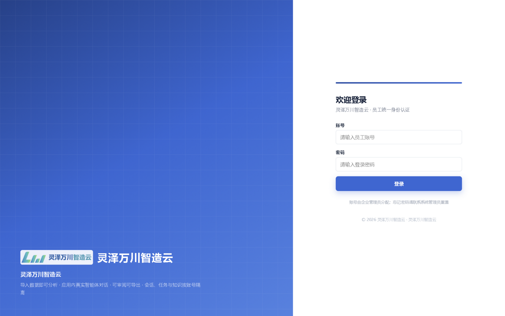
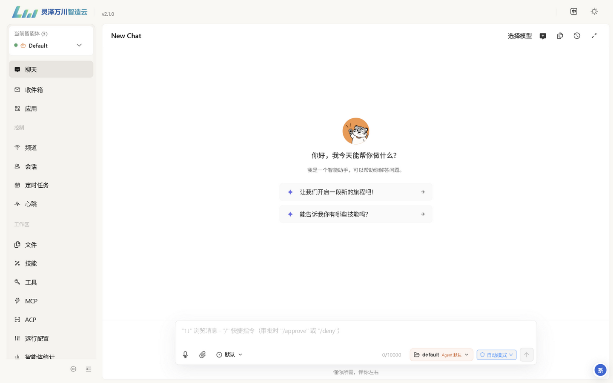
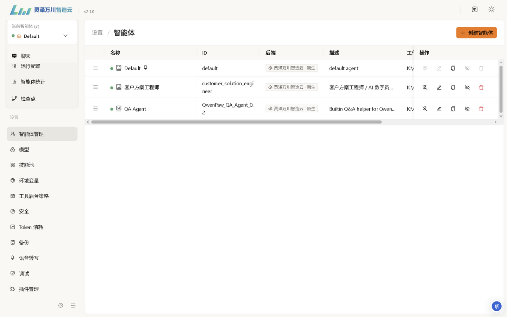
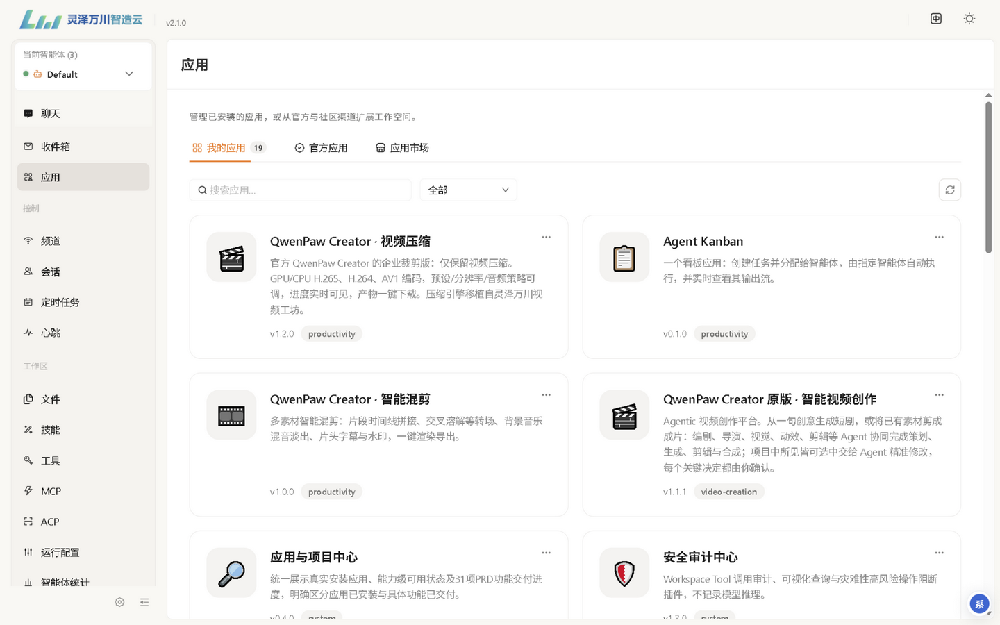
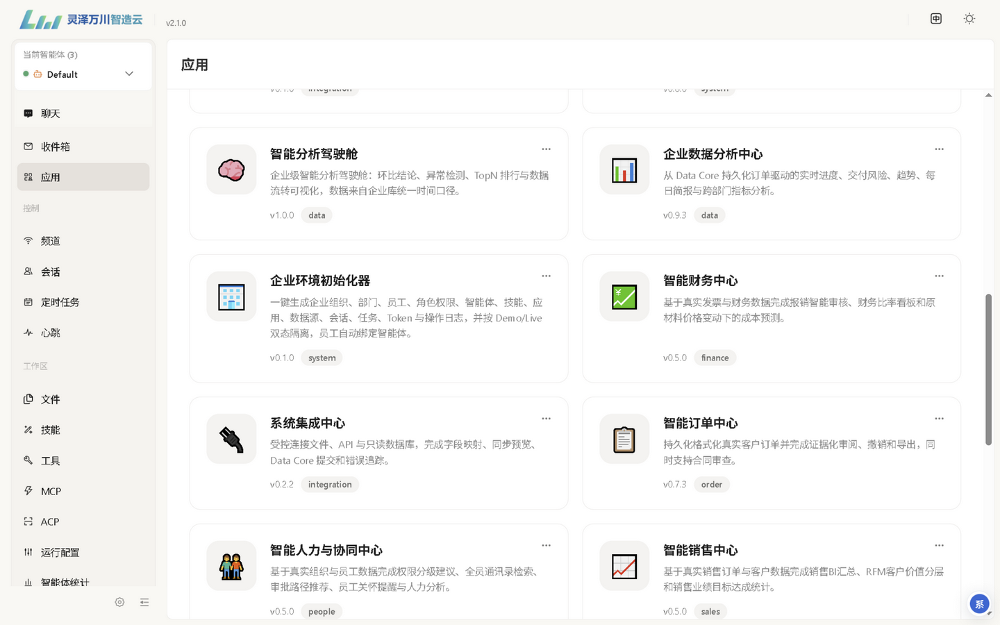
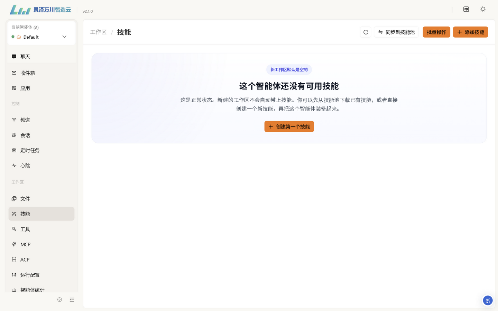
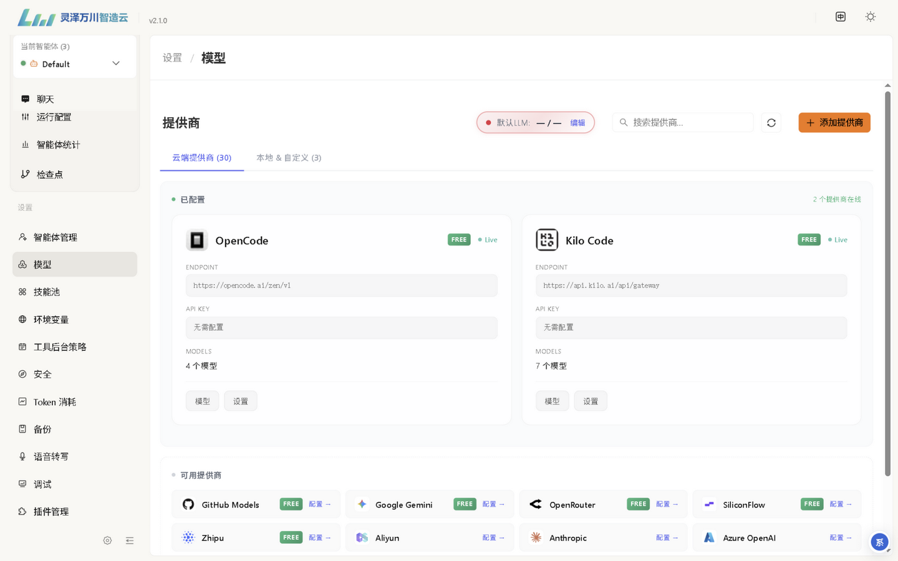

# 灵泽万川智造云 AI-OS 使用说明书

> ⚠️ **版本转型公告（2026-09-04）**：智造云 AIOS 2.2.0 起转为“原版 QwenPaw 2.2.0 + QwenPaw Hub”的极简形态，
> **不再捆绑任何业务应用**，登录改用 QwenPaw 原生认证。本说明书 v1.x 版本中涉及 19 个业务应用、
> 会员账号插件登录的章节已随剥离失效；登录、模型配置（Hub 集中管理）、托盘、FAQ 中的通用部分仍适用。
> 新版产品定义见 `docs/product/PRD-V7.0-AIOS-2.2.0.md`。本手册将随 2.2.0 正式发布重写。

> 适用版本：v2.2.0（底层运行时 QwenPaw 2.2.0）
> 适用系统：Windows 10/11 x64（Linux 请参考仓库 README 使用 .sh 入口）
> 文档中的界面截图均来自真实运行实例

---

## 目录

1. [产品简介](#1-产品简介)
2. [安装](#2-安装)
3. [启动与登录](#3-启动与登录)
4. [控制台界面总览](#4-控制台界面总览)
5. [智能体：切换、管理与对话](#5-智能体切换管理与对话)
6. [业务应用中心](#6-业务应用中心)
7. [技能与技能池](#7-技能与技能池)
8. [模型配置（重要）](#8-模型配置重要)
9. [其他常用设置](#9-其他常用设置)
10. [服务状态与托盘图标](#10-服务状态与托盘图标)
11. [常见问题 FAQ](#11-常见问题-faq)
12. [目录结构与常用入口](#12-目录结构与常用入口)

---

## 1. 产品简介

灵泽万川智造云 AI-OS 是一套**部署在企业自己电脑上**的 AI 操作系统：

- **底座是 QwenPaw 2.2.0**——一个具备长期记忆、技能扩展、多智能体与工具安全管控的智能体运行时（官方文档：https://qwenpaw.agentscope.io/ ）。
- 在底座之上预装了 **19 个应用（PawApp，以应用中心实际列表为准）**：统一数据中心、智能订单中心、企业数据分析中心、智能财务中心、工作区知识库等，覆盖制造企业经营的主要环节。
- **业务数据存储在本机**：Workspace 数据、数据库与审计日志保存在本机，没有第三方托管；存储位置分两处——安装目录内（Workspace、部分数据库、审计日志）与安装目录旁的同级目录 `.qwenpaw-runtime-data`（七个业务库，详见 Q7），备份需两处一起拷贝。注意出网边界：对话与附件内容是否传输到外部取决于所选模型——使用本地模型（Ollama / LM Studio，见第 8 节）时模型推理不出内网，但启用联网搜索/网络工具、MCP 连接器或 IM 频道时，相关请求内容仍会发往对应外部服务；使用云端模型供应商时，对话内容会发送给对应供应商处理。请按企业数据策略组合配置。
- 所有敏感操作有**审计与灾难性操作阻断**保护（多员工场景下的数据权限分级在路线图中，当前请以企业管理员分配的账号与角色为准）。

一句话理解：**它是一个装在公司电脑里的"AI 员工团队"——每个智能体是一名员工，每个应用是一个工作台。**

---

## 2. 安装

### 2.1 系统要求

| 项目 | 要求 |
| --- | --- |
| 操作系统 | Windows 10/11 x64 |
| 磁盘空间 | ≥ 3 GB（安装包本体约 400 MB，解压后约 2.5 GB） |
| 网络 | 离线包无需联网；在线安装首需联网 |

### 2.2 离线安装包（推荐，双击即可）

1. 双击 `zhiyun-ai-os-v<版本>-setup.exe`。
2. 若 Windows 弹出 **SmartScreen 蓝色提示**（"Windows 已保护你的电脑"），点击 **更多信息 → 仍要运行**。这是因为安装包尚未购买代码签名证书，属于预期行为；发布页会公布 SHA256 校验值供核对。
3. 按安装向导四步走：

| 步骤 | 页面 | 你需要做的 |
| --- | --- | --- |
| 1 | 欢迎页 | 阅读流程说明，点"下一步" |
| 2 | 选择目录 | 默认 `C:\zhizaoyunAIOS`，可更换（建议不含空格的路径）；v1.6.0+ 的向导会自动检查剩余空间 ≥ 3 GB（旧版安装器无此检查，请自行确认磁盘充足） |
| 3 | 进度页 | 全自动：解压文件 → 离线安装 Python 运行时与全部应用（3~10 分钟，进度区会实时滚动日志）→ 创建快捷方式 |
| 4 | 完成页 | 点"立即启动"直接进入系统 |

4. 安装完成后：
   - 桌面与开始菜单出现 **"智造云 AI-OS"** 快捷方式（品牌齿轮图标）；
   - 控制面板"应用"中出现卸载项；
   - 安装目录内生成 `卸载智造云AI-OS.cmd`（可移除快捷方式与卸载项）。

> **覆盖升级**：直接用新版本安装包装到同一目录即可。安装程序会先自动停止正在运行的旧服务，再解压新版并重启，不会丢失 Workspace 数据。

### 2.3 在线一键安装

双击 `install-oneclick.cmd`（需已安装 Node.js 20+ 与 Git）。脚本自动完成：安装运行时与锁定应用 → 启动服务 → 等待就绪后打开浏览器；v1.6.0+ 还会自动创建桌面快捷方式（旧版请手动收藏 http://127.0.0.1:8088 或运行 `scripts\make-desktop-shortcut.ps1`）。

---

## 3. 启动与登录

### 3.1 启动

双击桌面的 **"智造云 AI-OS"** 快捷方式。启动器会：

1. 自动拉起本地服务（首次约 1~3 分钟）；
2. 等待服务就绪（`/api/version` 探活）；
3. 以**独立应用窗口**（无地址栏）打开智造云桌面。

> 也可以直接访问 `http://127.0.0.1:8088`。局域网同事访问请用 `http://<你的IP>:8088`，并确认防火墙放行 8088 端口。

### 3.2 登录



- 2.2.0 使用 QwenPaw 原生登录：**首次使用请在登录页注册**，第一个注册的账号即管理员（请设高强度密码），后续用户自行注册或由管理员在 Hub 中创建。
- 忘记密码见 Q6（删除 `auth.json` 重置，会清除全部本地账户）。
- 忘记密码请联系系统管理员重置。
- 账号由企业管理员分配；多员工协同场景下的权限分级能力以实际版本功能为准。

---

## 4. 控制台界面总览

登录后进入控制台（Console）：



左侧导航栏从上到下分为四组：

| 分组 | 入口 | 用途 |
| --- | --- | --- |
| 当前智能体 | 顶部下拉框 | 切换/管理智能体，绿点表示运行中 |
| 主功能区 | **聊天** | 与当前智能体对话（主界面） |
| | **收件箱** | 接收智能体推送的消息与通知 |
| | **应用** | 业务应用中心（PawApp） |
| 控制 | 频道 | 接入钉钉、飞书、微信等 IM 频道 |
| | 会话 | 历史会话列表与恢复 |
| | 定时任务 | Cron 自动化任务 |
| | 心跳 | 智能体主动巡检/主动汇报 |
| 工作区 | 文件 | 通用文件工作区（浏览、上传、编辑、Diff） |
| | 技能 | 当前智能体已装备的技能 |
| | 工具 / MCP / ACP | 工具、外部协议连接器管理 |
| | 运行配置 / 智能体统计 | 运行参数与用量统计 |
| 设置 | 智能体管理 / 模型 / 技能池 / 安全 / 备份 / Token 消耗 / 插件管理 等 | 系统级配置 |

主界面即聊天区：`New Chat` 新建会话；输入框支持 `↑↓` 浏览消息、`/` 快捷指令（审批时用 `/approve` 或 `/deny`）；可上传附件；右下角可选择 Loop 模式与安全模式。

---

## 5. 智能体：切换、管理与对话

### 5.1 内置智能体

系统预置 2 个智能体（设置 → 智能体管理；截图拍摄于早期版本，含后续版本未随包发布的测试智能体，以实际列表为准）：



| 智能体 | ID | 说明 |
| --- | --- | --- |
| Default | `default` | 默认通用助手 |
| 客户方案工程师 | `customer_solution_engineer` | AI 数字员工：客户方案生成、企业联系人深度挖掘，带行业知识库 |

左上角"当前智能体"下拉框可随时切换；每个智能体拥有**独立的记忆、技能与会话**。

### 5.2 与智能体对话

1. 在"聊天"页输入问题，回车发送。
2. 智能体调用工具（查数据库、读文件、搜网页等）时，界面会实时显示执行过程。
3. 涉及敏感操作（写文件、执行命令等）时**是否弹出审批卡片取决于当前工具审批策略**（设置 → 工具后台策略 / 会话内的工具审批模式，含 allow/deny/ask/sandbox）：`ask` 逐项弹卡，输入 `/approve` 批准、`/deny` 拒绝；`allow`（自动模式）按策略直接放行不弹卡。对敏感账号建议保持 `ask`。
4. 会话自动持久化——滚动出窗口的历史记录不丢失，可在"会话"页恢复。
5. 长任务可中途关闭，之后从"会话"续接。

> 智能体的能力 = 模型 + 技能 + 工具 + 记忆。**没有配置模型前，智能体无法回答**（见第 8 节）。

---

## 6. 业务应用中心

左侧导航"应用"进入应用中心，这里集中管理全部业务 PawApp。应用中心只列出**声明了桌面入口的 `app` 型插件**（如数据中心、订单中心等业务应用）；`general` 型系统插件（如 Logo 配置）没有应用入口，不会出现在列表中，属正常现象：





### 预装应用一览（以应用中心实际列表为准）

| 应用 | 类别 | 用途 |
| --- | --- | --- |
| 统一数据中心 | data | 企业统一数据库：订单、生产、组织等真实数据源 |
| 企业数据分析中心 | data | 从 Data Core 驱动的交付进度、交付风险、趋势与日报分析 |
| 智能分析驾驶舱 | data | 环比结论、异常检测、TopN 排行与数据流转可视化 |
| 智能订单中心 | order | 真实客户订单持久化、证照化审阅、撤销与导出、合同审查 |
| 采购与供应链中心 | supply | 采购与供应链业务台 |
| 智能销售中心 | sales | 销售 BI 汇总、RFM 客户价值分层、销售业绩统计 |
| 智能财务中心 | finance | 报销智能审核、财务比率看板、原材料价格变动成本预测 |
| 智能人力与协同中心 | people | 权限分级建议、全员通讯录、审批路径推荐、人力分析 |
| 智能售后服务中心 | service | 售后工单与服务台 |
| 系统集成中心 | integration | 受控连接文件、API 与只读数据库，字段映射与同步预览 |
| 用友畅捷通连接中心 | integration | 畅捷通数据接入 |
| 应用与项目中心 | system | 展示真实安装应用、可用状态与 PRD 功能交付进度 |
| 安全审计中心 | system | Workspace 工具调用审计、灾难性高风险操作阻断 |
| AI-OS Logo 配置 | system | 企业 Logo 与品牌配置 |
| 工作区知识库 | knowledge | 工作区资料的向量化知识库与检索 |
| Agent Kanban | productivity | 看板式任务分配：创建任务并分配给智能体自动执行，实时查看输出流 |
| QwenPaw Creator · 视频压缩 | productivity | 企业裁剪版视频压缩（H.265/H.264/AV1） |
| QwenPaw Creator · 智能混剪 | productivity | 多素材智能混剪、转场、配乐、字幕一键渲染 |
| QwenPaw Creator 原版 · 智能视频创作 | video-creation | Agentic 视频创作平台：一句话生成短剧，Agent 协同完成策划/生成/剪辑/合成 |

> 除上述应用目录外，系统还内置两个系统组件（不出现在应用中心）：**员工账号登录与权限**（统一身份认证）、**企业环境初始化器**（生成企业组织环境，见 Q10）。

**打开方式**：在应用卡片上点击即可进入应用；也可以直接在聊天里让智能体帮你操作（例如"帮我查上个月的订单交付风险"，智能体会调用 Data Studio 的工具）。

> **数据从哪来？** 业务应用遵循"空数据保持可见的空态"原则——不造演示数据。企业环境初始化器可一键生成一套完整的 Demo 企业数据（双态隔离，Demo 与 Live 分开）；也可以通过系统集成中心接入真实数据源。

---

## 7. 技能与技能池

技能（Skill）是智能体学到的"本领"——一个技能就是一个带说明书的工具包（对应 QwenPaw Skills 体系）。



- **新工作区默认没有技能，这是正常状态。**
- 添加方式：
  - **添加技能**：直接创建（可让智能体帮你写）；
  - **技能池**：从技能池下载已有技能再装备给智能体；
  - **同步到技能池**：把当前技能共享到池子供其他智能体使用。
- 客户方案工程师等预置智能体已自带技能与知识库，开箱即用。

---

## 8. 模型配置（重要）

**没有配置模型，智能体无法对话。** 进入 设置 → 模型：



1. 页面聚合了 30+ 云端供应商与本地/自定义供应商（智谱、Aliyun、Anthropic、Azure OpenAI、OpenRouter、SiliconFlow、Google Gemini、GitHub Models、Ollama、LM Studio 等）。
2. 点击供应商卡片右侧 **配置**，填入 API Key / Endpoint。
3. 配置完成后在页面顶部 **默认 LLM** 处选择默认模型（截图中的 `默认 LLM: — / —` 表示尚未配置）。
4. 回到聊天页右上角"选择模型"确认当前会话使用的模型。

> **本地模型（推理不出内网）**：如使用 Ollama，配置 Base URL 为 `http://127.0.0.1:11434`；LM Studio 为 `http://127.0.0.1:1234/v1`。"不出内网"仅指模型推理端点：若同时启用联网搜索/网络工具、MCP 连接器或 IM 频道，对话中相关内容仍会发送到这些工具指向的外部服务。更多细节参考 QwenPaw 官方文档：https://qwenpaw.agentscope.io/docs/quickstart

---

## 9. 其他常用设置

| 入口 | 用途 |
| --- | --- |
| 频道 | 把智能体接入钉钉、飞书、微信、Discord、Telegram 等，一个实例全频道可达 |
| 定时任务 | Cron 定时自动化：日报、摘要、巡检按时间表自动运行 |
| 心跳 | 智能体定时主动巡检并汇报 |
| 环境变量 | 配置模型 Key 等环境变量 |
| 工具后台策略 / 安全 | 工具执行治理（allow/deny/ask/sandbox）与浏览器安全 |
| Token 消耗 | 用量与成本统计 |
| 备份 | 工作区备份与恢复 |
| 语音转写 | 语音输入相关能力 |
| 调试 | 开发者调试信息 |

---

## 10. 服务状态与托盘图标

智造云由后台服务（端口 8088）驱动。**关闭应用窗口 ≠ 关闭服务**——服务会继续在后台运行，供其他窗口、其他同事或定时任务使用。

自 **v1.6.0** 起，桌面启动器常驻系统托盘（通知区），状态一目了然：

| 托盘图标 | 状态 | 含义 |
| --- | --- | --- |
| 🟢 绿色角标 | 运行中 | 服务正常（后台占用约数百 MB 内存属正常） |
| 🟠 橙色角标 | 启动中 | 正在拉起服务，请稍候 |
| ⚪ 灰色角标 | 已停止 | 服务未运行 |

托盘右键菜单：

- **打开智造云**：打开应用窗口（服务未启动会先自动启动）
- **停止后台服务**：立即释放服务占用的内存与 CPU
- **启动后台服务**：重新拉起
- **退出（并停止后台服务）**：彻底关闭，不留任何后台进程

> v1.5.x 的过渡做法：任务管理器中结束 `python.exe`（QwenPaw 服务）即可释放资源；或运行安装目录的 `卸载智造云AI-OS.cmd` 前它会自动停止服务。

---

## 11. 常见问题 FAQ

**Q1：双击安装包提示"Windows 已保护你的电脑"？**
正常现象（安装包未签名）。点"更多信息 → 仍要运行"。可核对发布页公布的 SHA256 值。

**Q2：登录密码忘了？**
联系系统管理员重置。管理员操作（官方文档提供的账户重置方式，会清除全部本地账户，重新注册即可）：先停止服务，删除服务数据目录下的 `auth.json`，再重新启动。

**Q3：智能体不回复 / 提示没有可用模型？**
模型未配置。见第 8 节，先在 设置 → 模型 配置供应商并设置默认 LLM。

**Q4：提示 8088 端口被占用？**
启动器会先自动接管本系统自己的旧实例；若仍提示占用，说明 8088 被其他程序（或另一套安装）占用，不是智造云的服务。请确认该端口用途后释放，再重新启动。运行 `diagnose-ai-os.cmd` 可一键诊断。

**Q5：电脑变卡，怎么确认是智造云在占用？**
看托盘图标（🟢 即在运行）；不需要时右键 → 停止后台服务。服务空闲时占用很低，主要开销在模型推理与会话处理时。

**Q6：安装/启动日志在哪？**
- 向导式安装（v1.6.0+）：安装目录 `install-wizard.log`
- 静默安装（`--dir`）：安装目录 `install-log.txt`
- 启动器拉起服务：安装目录 `launcher-service.log`
- 服务运行日志：`apps\zhizaoyunAIOS\workspace\workspaces\<智能体>\logs\`

**Q7：如何升级/备份？数据都在哪？**
升级：用新版本安装包装到同一目录，自动停旧服务→覆盖→重启，数据保留。
备份/迁移时注意数据分两处：① 安装目录内（Workspace、数据库、审计日志等）；② **安装目录旁边的同级目录 `.qwenpaw-runtime-data`**（订单、售后、供应链、销售、财务、人力等七个业务库在此），备份必须两处一起拷贝，只备份安装目录会丢业务数据。

**Q8：如何彻底卸载？**
控制面板 → 应用 → 灵泽万川智造云 AI-OS → 卸载（或运行安装目录 `卸载智造云AI-OS.cmd`），再手动删除安装目录**及其旁边的同级 `.qwenpaw-runtime-data` 目录**（业务数据库在此）。**卸载前请确认不再需要数据或已按 Q7 备份**。

**Q9：局域网同事能访问吗？**
能。请管理员在服务所在电脑放行 8088 端口（Windows 防火墙），同事浏览器访问 `http://<主机IP>:8088` 登录使用。对外暴露服务前请评估企业网络安全策略。

**Q10：想做演示数据给领导看？**
使用"企业环境初始化器"一键生成 Demo 态企业环境（企业信息、组织架构、部门、员工账号、角色权限、智能体与数据源登记等），Demo 与 Live 双态隔离，不会污染真实数据。注意：它生成的是企业环境骨架，**不含业务订单/生产明细**；业务明细数据请通过"系统集成中心"导入真实数据，或在统一数据中心使用明确标注的模拟数据生成功能。

---

## 12. 目录结构与常用入口

```
<安装目录>\
├─ 智造云AI-OS.exe            桌面启动器（托盘常驻，v1.6.0+）
├─ 智造云AI-OS启动.cmd         备用启动入口（开服务+浏览器）
├─ 卸载智造云AI-OS.cmd         卸载入口
├─ start-ai-os.cmd            启动服务（前台，排障用）
├─ check-ai-os.cmd            运行体检
├─ diagnose-ai-os.cmd         一键诊断（端口/进程/日志）
├─ USB-INSTALL.md             离线安装说明
├─ apps\zhizaoyunAIOS\        运行时与 Workspace（业务库在同级的 .qwenpaw-runtime-data，见 Q7）
│  ├─ runtime\                Python 运行时、PawApp 物料
│  └─ workspace\              工作区：auth\ 数据库\ workspaces\ plugins\
├─ plugins\                   系统插件
└─ extras\node\               便携 Node.js（离线包内嵌）
```

| 入口 | 地址/命令 |
| --- | --- |
| 控制台 | http://127.0.0.1:8088 |
| 体检 | `check-ai-os.cmd` |
| 诊断 | `diagnose-ai-os.cmd` |

---

## 附录：参考文档

- QwenPaw 官方仓库：https://github.com/agentscope-ai/QwenPaw
- QwenPaw 中文说明：https://github.com/agentscope-ai/QwenPaw/blob/main/README_zh.md
- QwenPaw 在线文档（快速开始/Skills/频道/Cron/桌面端）：https://qwenpaw.agentscope.io/
- 本仓库 README 与 `USB-INSTALL.md`

> 本说明书随版本更新。界面截图基于 v1.5.x 实测，不同版本界面可能略有差异。
